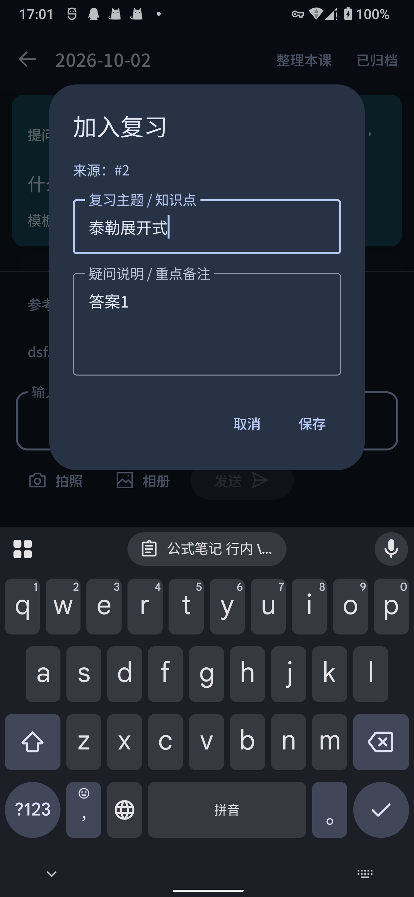
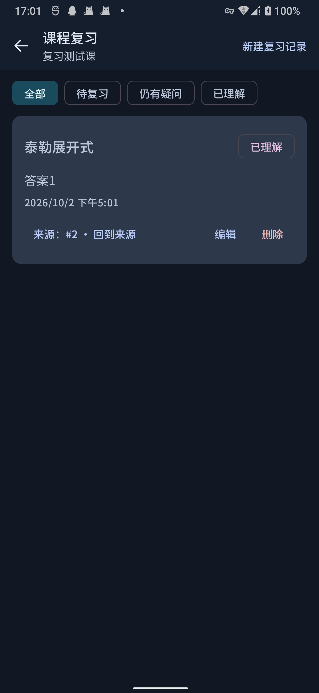

# 课程复习记录（Course Review Records）首版实施报告

## 1. 概述与设计边界

本变更实现了 FeiyuNote “课程复习记录”的首版本地操作闭环，严格落实用户讨论共识与规范约定：

- **业务目标**：帮助学生在课程学习过程中记录疑难点与知识状态（“待复习 / 已理解 / 仍有疑问”），支持随时修改、删除、标记状态并回溯原提问/回答/笔记。
- **作用域边界**：
  - 严格限定在单个 `COURSE` 笔记本内（按 `notebookId` 实现逻辑约束与隔离），练习本（`PRACTICE`）与通用对话（`GENERAL_ID`，即 -2）严禁开放复习记录。
  - 数据层强制校验：公开接口统一要求 `notebookId` 并校验 `COURSE` 类型（排除 `GENERAL_ID`）；跨课程 ID 篡改操作一律拒绝。
  - 严禁引入全局跨课记忆、跨课自动检索、普通问答自动注入、后台摘要或能力画像。
  - 本地纯数据操作闭环，**零模型请求消耗**。
- **生命周期与不变量**：
  - 笔记本删除：外键级联删除该课程下全部复习记录。
  - 来源条目/线程/课次/笔记删除：在同一事务中保留复习记录及原文本，置 `source_deleted = 1`，界面展示“来源已删除”并禁用跳转，避免笔记内容随聊天或课次清理丢失。
  - 来源分类精准路由：点击“回到来源”时，`NOTE` 条目精准路由到笔记页面（`NoteKey`），已归档条目路由到归档页面（`ArchivedKey`），活动问答助手回复路由到对应课次定位行（`LessonKey(focusEntryId)`），返回时保留复习列表与原筛选状态。
  - 防重插入：同一来源条目在同一课程下仅能创建一条有效复习记录，避免重复点击产生重复数据。
  - 保存容错：异步写入成功才关闭弹窗；保存中禁用重复提交；写入失败、条目被删或网络异常时展示可理解错误，**绝不静默丢弃草稿**；支持页面旋转/重建后上下文保持；遵从协程取消。

---

## 2. 数据层与 SQLite v4 架构

### 2.1 数据模型与操作结果
- [`ReviewStatus`](../app/src/main/java/com/feiyu/notes/data/Models.kt): 枚举类型，对应数据库字符串字段：
  - `PENDING` ("pending"): 待复习
  - `UNDERSTOOD` ("understood"): 已理解
  - `CONFUSED` ("confused"): 仍有疑问
- [`ReviewRecord`](../app/src/main/java/com/feiyu/notes/data/Models.kt): 数据类，包含字段：
  - `id: Long`, `notebookId: Long`, `topic: String`, `notes: String`, `sourceEntryId: Long? = null`, `sourceDeleted: Boolean = false`, `status: ReviewStatus = ReviewStatus.PENDING`, `createdAt: Long`, `updatedAt: Long`
- [`ReviewInsertResult`](../app/src/main/java/com/feiyu/notes/data/Models.kt): 明确区分 5 种写入结果：
  - `Success(val record: ReviewRecord)`: 写入成功
  - `AlreadyExists(val existingRecord: ReviewRecord)`: 该来源条目已存在有效复习记录
  - `SourceNotFound`: 来源条目不存在、已被删除、非已完成内容或不属于本课程
  - `InvalidCourse`: 笔记本不存在、为通用对话或非 `COURSE` 类型
  - `Failed`: 数据库写入失败或输入为空

### 2.2 SQLite Schema (v4)
在 [`NotebookDatabase.kt`](../app/src/main/java/com/feiyu/notes/data/NotebookDatabase.kt) 中将数据库版本升级至 `VERSION = 4`：

```sql
CREATE TABLE IF NOT EXISTS review_records (
    id INTEGER PRIMARY KEY AUTOINCREMENT,
    notebook_id INTEGER NOT NULL REFERENCES notebooks(id) ON DELETE CASCADE,
    topic TEXT NOT NULL,
    notes TEXT NOT NULL,
    source_entry_id INTEGER,
    source_deleted INTEGER NOT NULL DEFAULT 0,
    status TEXT NOT NULL CHECK (status IN ('pending', 'understood', 'confused')),
    created_at INTEGER NOT NULL,
    updated_at INTEGER NOT NULL
);
CREATE INDEX IF NOT EXISTS idx_review_records_notebook ON review_records(notebook_id);
```

- **外键与 CHECK 约束说明**：
  - `notebook_id` 设置外键并 `ON DELETE CASCADE`，保证课程删除时完整级联清理复习记录。
  - `source_entry_id` 刻意**不设**外键约束，以支持在源条目（问答、笔记）被删除时，复习记录能够继续保留学生自主总结的知识点正文，并通过应用层标记 `source_deleted = 1` 标识来源已失效。
  - `status` 带有 SQLite `CHECK (status IN ('pending', 'understood', 'confused'))` 约束。
- **非破坏性迁移**：在 `onUpgrade (oldVersion < 4)` 中执行上述建表与建索引操作。保留原有 `oldVersion < 2`（多图字段）与 `oldVersion < 3`（模板来源）升级逻辑。v3→v4 升级中不执行 `seedGuidedTemplate`，完整保留用户已修改、删除或导入的模板，不发生模板重复播种。

### 2.3 存储与数据访问安全约束 ([`NotebookStore.kt`](../app/src/main/java/com/feiyu/notes/data/NotebookStore.kt))
- 移除所有无 `notebookId` 的非限定公开接口。所有复习记录操作强制传入 `notebookId`：
  - `listReviewRecords(notebookId: Long): List<ReviewRecord>`
  - `getReviewRecord(notebookId: Long, recordId: Long): ReviewRecord?`
  - `findReviewRecordBySource(notebookId: Long, sourceEntryId: Long): ReviewRecord?`
  - `insertReviewRecord(notebookId: Long, topic: String, notes: String, sourceEntryId: Long? = null, status: ReviewStatus = PENDING): ReviewInsertResult`
  - `addReviewRecord(notebookId: Long, ...): ReviewRecord?`（便捷包装，成功或已存在返回记录）
  - `updateReviewRecord(notebookId: Long, recordId: Long, topic: String, notes: String, status: ReviewStatus? = null): Boolean`
  - `setReviewStatus(notebookId: Long, recordId: Long, status: ReviewStatus): Boolean`
  - `deleteReviewRecord(notebookId: Long, recordId: Long): Boolean`
  - `isThreadArchived(entryId: Long): Boolean`（递归检查来源所在的问答树根节点是否已归档）
- **通用对话隔离 (GENERAL_ID = -2)**：`NotebookStore.generalChat()` 创建的通用对话在底层数据表中 `kind = 'course'`，`isCourseNotebook` 显式判定 `notebookId != GENERAL_ID && count("SELECT COUNT(*) FROM notebooks WHERE id = ? AND kind = 'course'", notebookId) == 1L`，彻底杜绝通用对话被误识别为课程。
- **输入校验**：数据层在 `insertReviewRecord` 与 `updateReviewRecord` 中严格检查 `topic.isBlank()`，空白主题直接返回失败，防止空记录入库。
- **时钟注入**：所有新增、修改、来源标记失效操作统一使用注入的 `clock()`，包括 `deleteLesson`、`deleteThread` 与 `deleteNote`。
- **单条笔记删除级联保护**：`deleteNote(noteId)` 在同一事务中执行 `UPDATE review_records SET source_deleted = 1, updated_at = ? WHERE source_entry_id = ? AND source_deleted = 0`，确保单独删除笔记后对应复习记录正确变为失效状态。

---

## 3. UI 交互、路由与草稿保护

- **编辑与添加对话框** ([`ReviewRecordEditDialog`](../app/src/main/java/com/feiyu/notes/ui/CourseReviewScreen.kt)):
  - 生产代码直接绑定 [`ReviewDialogState`](../app/src/main/java/com/feiyu/notes/ui/ReviewState.kt)，统一管理表单状态与提交状态机。
  - 采用异步签名：`onSave: suspend (topic: String, notes: String) -> String?`（成功返回 `null`，失败返回可理解错误文案）。
  - **保存成功才关闭**：仅在 `state.submit` 返回 `true` 时触发 `onDismiss()`。
  - **防重复提交**：保存过程中锁定 `saving = true`，禁用保存按钮、取消按钮及文本编辑，防止手抖重复提交；`saving` 在 Saver 恢复时重置为 `false`，页面重建时不会卡死在无运行协程的 `saving=true` 状态。
  - **协程取消遵从**：捕获 `CancellationException` 时显式重抛，不吞掉生命周期取消。
  - **草稿保护**：`ReviewDialogState` 配备自定义 `Saver` 并通过 `rememberReviewDialogState` 持久化，保存失败或抛出异常时显示错误提示，草稿内容完整保留。外层 `editingRecordId` 同样采用 `rememberSaveable`，屏幕旋转或 Activity 重建后编辑对话框不意外关闭。
- **状态区分与反馈**：
  - [`StudyViewModel.addToReview`](../app/src/main/java/com/feiyu/notes/study/StudyViewModel.kt) 与 [`NoteScreen`](../app/src/main/java/com/feiyu/notes/ui/NoteScreen.kt) 完整处理 `ReviewInsertResult`：
    - `Success` -> 提示“已加入复习”，关闭对话框；
    - `AlreadyExists` -> 对话框提示“该内容已在复习记录中”，保留草稿；
    - `SourceNotFound` -> 对话框提示“来源内容已删除或不可用”，保留草稿；
    - `InvalidCourse` / `Failed` -> 对话框提示“保存失败，请稍后重试”，保留草稿。
- **主界面与卡片** ([`CourseReviewScreen.kt`](../app/src/main/java/com/feiyu/notes/ui/CourseReviewScreen.kt)):
  - 顶部栏展示课程名称与新建按钮。
  - `FilterChip` 筛选（全部 / 待复习 / 已理解 / 仍有疑问）。
  - 下拉快速切换状态、弹窗编辑、确认删除；操作按钮文案明确区分“编辑”（`edit`）与“删除”（`delete`）。
  - 卡片展示本地化格式的最后更新时间（`updatedAt`）。
- **精准来源导航与返回栈** ([`AppNavigation.kt`](../app/src/main/java/com/feiyu/notes/ui/AppNavigation.kt)):
  - 通过 [`ReviewSourceDestination`](../app/src/main/java/com/feiyu/notes/ui/ReviewState.kt) 区分三种目标：
    - `Note` -> `backStack.add(NoteKey(notebookId, lessonId, noteId))`
    - `Archived` -> `backStack.add(ArchivedKey(notebookId, lessonId))`
    - `Chat` -> `backStack.add(LessonKey(notebookId, lessonId, focusEntryId = entryId))`
  - 使用 `backStack.add` 压栈，用户从来源页面按返回键时直接弹出并返回课程复习列表，原滚动与筛选状态完整保留。

---

## 4. 测试与验证证据

### 4.1 自动化测试证据
1. **JVM 单元测试**（76 项全部通过，`./gradlew testDebugUnitTest`）：
   - [`ReviewRecordModelTest.kt`](../app/src/test/java/com/feiyu/notes/data/ReviewRecordModelTest.kt)（6 项测试全部通过）：
     - 状态数据库映射字符串 (`pending`, `understood`, `confused`)。
     - 状态解析及非法值回退 `PENDING`。
     - 字段默认值及 copy 生命周期。
     - `ReviewInsertResult` 密封接口数据载荷完整性。
   - [`ReviewInteractionTest.kt`](../app/src/test/java/com/feiyu/notes/ui/ReviewInteractionTest.kt)（10 项生产状态组件测试全部通过）：
     - 问答默认复习主题/摘要提取（首行截取、超长截断、空白回退默认标题）。
     - 笔记默认复习主题/摘要提取（40 字/120 字截取）。
     - 对话框空白主题拦截、提交前后 trim 校验。
     - 对话框保存失败（如来源已删除）时草稿完整保留验证。
     - 对话框异常时草稿完整保留验证。
     - 对话框遵从协程取消：重抛 `CancellationException` 且重置 `saving` 状态。
     - `ReviewInsertResult` 到 5 种用户反馈文案的精确映射验证。
     - `ReviewDialogState.Saver` 跨恢复重置 `saving` 并保留草稿。
     - 并发重入拦截：保存进行中再次提交立即被拒绝，不发起重复请求。
   - 0.3.2 基础功能与既有单元测试回归（60 项全部通过）：
     - `ContextBuilderTest`、`ModelLabelTest`、`DiagnosticsTest`、`UpdateClientTest`、`FeedbackClientTest`、`DeepSeekClientTest`、`NoteExporterTest`、`MathTextTest`、`SkillImportTest`、`ThreadNavigationTest`。
2. **SQLite 与业务集成测试** ([`NotebookStoreTest.kt`](../app/src/androidTest/java/com/feiyu/notes/data/NotebookStoreTest.kt))：
   - 26 项真实 SQLite 测试全部通过，涵盖数据隔离、跨课防篡改、空白拒绝、未完成拒绝、级联删除标记、v1/v2/v3→v4 升级等。
3. **端到端 UI 测试** ([`UiFlowTest.kt`](../app/src/androidTest/java/com/feiyu/notes/ui/UiFlowTest.kt))：
   - 17 项调度：15 项通过，2 项有理由跳过（折叠屏仿真硬件限制与 API 31 语言切换系统限制）。
   - 包含问答来源全周期（`courseReviewWorkflowFullCycle`）、笔记来源全周期（`courseReviewNoteSourceWorkflow`）、归档来源及删除标记（`courseReviewArchivedAndEditDeleteWorkflow`）、编辑对话框草稿保留与校验（`courseReviewDialogFailureAndDraftRetention`）。

### 4.2 构建产物与 SHA256
```bash
bash ./gradlew testDebugUnitTest assembleDebug assembleDebugAndroidTest --console=plain
```
- **测试结果**：76 / 76 项 JVM 单元测试通过，0 失败。
- **Debug APK**：`app/build/outputs/apk/debug/app-debug.apk`
  - 版本信息：versionName `0.3.2`, versionCode `7`
  - SHA256: `9728c0835bb9cbe01aafde7f04a3826f33ea7cd61c02468f00ad44c993de6340`（移除 `app/src/debug/AndroidManifest.xml` 锁屏配置后重新构建）
- **AndroidTest APK**：`app/build/outputs/apk/androidTest/debug/app-debug-androidTest.apk`
  - SHA256: `28e691d8507bff8e6adf7808c8cf9c19aace61c07e9a1d0e8758163af45b9e76`
- **代码规范**：`git diff --check` 0 警告 0 报错。

### 4.3 设备与环境状态核实（真机已连通与测试实测）
- **工具与路由状态**：`adb` 37.0.1，通过 Windows ADB (`127.0.0.1:5037`) 与 SSH 远程转发 (`127.0.0.1:5038`) 成功连接开发机：
  - 设备型号：SHARP A101SH（Android 12 / API 31，serial `354xxx644` 脱敏）。
  - 环境变量配置：`ADB_SERVER_SOCKET=tcp:127.0.0.1:5038`。
- **真机已实测项**：
  - **合并上游 `bbefb79` 后主套件单次全量执行**：**共 51 项调度用例：49 通过、2 跳过、0 失败**
    - 日志文件：`build/course-review-validation/device-test-354xxx644-data_NotebookStoreTest_study_GeneratorTest_ui_UiFlowTest-e9513fd-20261002_082717.log`
    - `com.feiyu.notes.data.NotebookStoreTest`（26 项全部通过）：包含真实 SQLite 下 v1/v2/v3→v4 升级迁移、GENERAL_ID 排除、跨课隔离防篡改、空白拦截、级联标记等；
    - `com.feiyu.notes.study.GeneratorTest`（8 项全部通过）：生成重试、模板删除选择、多图保留与取消处理；
    - `com.feiyu.notes.ui.UiFlowTest`（17 项调度：15 通过，2 跳过，0 失败，在移除 debug 锁屏配置后的最新构建上完整实测）：
      - 验证了问答、笔记、归档三种来源加入复习与返回栈闭环；
      - 验证了编辑对话框长文本输入与键盘收起、重建草稿保留；
      - 验证了来源删除后“来源已删除”红色徽标展示与跳转安全拦截；
      - 2 项测试如实记录跳过：`layoutAdaptsToWindowWidthAndKeepsDraft`（直板物理机不适用折叠屏 `wm size`）与 `nonChineseLanguageUsesEnglishAndChineseUsesChinese`（API 31 不支持 Android 13 LocaleManager）。
  - **辅助组件测试核验说明**：早期阶段报告曾记录 [`MathRendererTest`](../app/src/androidTest/java/com/feiyu/notes/math/MathRendererTest.kt) (1 项) 与 [`ApiSettingsTest`](../app/src/androidTest/java/com/feiyu/notes/settings/ApiSettingsTest.kt) (2 项)。因归档中暂无对应独立的原始 runner 日志，按严谨原则从已确认总计中移出，标注为“历史阶段声称，当前未独立归档日志，不纳入最终已验证统计”。
- **开发机验证脚本与一键运行入口**：
  脚本 [`scripts/verify-course-review.sh`](../scripts/verify-course-review.sh) 配合 [`scripts/parse-test-runner.py`](../scripts/parse-test-runner.py) 准确解析终态状态码并分开记录 passed/skipped/failed：
  ```bash
  ADB_SERVER_SOCKET=tcp:127.0.0.1:5038 ./scripts/verify-course-review.sh -s 354974110447644
  ```

### 4.4 工程小修与离线验证
1. **测试脚本失败传播与 Windows 兼容** ([`scripts/verify-course-review.sh`](../scripts/verify-course-review.sh)):
   - 捕获 `ADB_EXIT` / `TEE_EXIT` 非零退出码，连同 `parse-test-runner.py` 退出码统一传播为脚本最终失败，禁止在传输或解析失败时输出 SUCCESS 或返回 0。
   - 脱敏生成 Windows 兼容文件名（使用 `xxx` 替换星号，如 `354xxx644`）。
2. **离线测试套件覆盖**：
   - [`scripts/test-verify-script.sh`](../scripts/test-verify-script.sh)：4 项离线 stub 用例（adb 失败、tee 失败、断言失败、全部通过）100% 通过。
   - [`scripts/test-runner-parser.sh`](../scripts/test-runner-parser.sh)：7 项解析器离线 fixture 用例 100% 通过。
3. **移除常态 Debug 锁屏配置**：
   - 删除了 `app/src/debug/AndroidManifest.xml` 中的 `android:showWhenLocked="true"` 与 `android:turnScreenOn="true"`，恢复普通日常调试体验，不越权绕过锁屏。

---

## 5. 待提 PR 标题与描述草稿

用户可复制以下内容向 `Yongzhaooo/FeiyuNote` 发起 Pull Request：

### PR Title:
```text
feat: 添加课程内复习记录
```

### PR Description:
```markdown
## 关联提议 / Approved Issue

Closes # <!-- 待用户按 CONTRIBUTING 提交提案并获批后填入 Issue 编号 -->

维护者确认范围的评论链接 / Link to the maintainer's scope approval: <!-- 待填写 -->

## 改动 / Changes

本 PR 实现了课程学习过程中的**课程内复习记录**本地操作闭环，帮助学生在听课与问答中显式标记与回顾疑难点：

### 核心功能与学习交互
- **显式复习记录**：支持学生在课程学习中将关键问答助手回复、整理笔记一键「加入复习」，或在复习列表中手工「新建」记录；
- **掌握状态标记**：每条复习记录支持标记「待复习 / 已理解 / 仍有疑问」，支持按状态快捷筛选；
- **精准来源回溯**：复习卡片提供「回到来源」按钮，问答条目精准定位到对应课次的聊天行，笔记条目跳转笔记详情，已归档条目跳转归档列表；通过返回键可直接退回原复习列表并保持滚动与筛选状态；
- **来源失效保护**：当源聊天条目、笔记或课次被删除时，复习记录保留学生总结的要点文本，状态标记为“来源已删除”并禁用跳转，避免笔记内容随聊天清理丢失；
- **零模型消耗与本地闭环**：纯本地 SQLite 数据库操作，不自动调用大模型，不自动注入提示词上下文，零 Token 消耗。

### 数据层与隔离保障
- **课程作用域隔离**：复习记录严格限定于单个 `COURSE` 笔记本（以 `notebookId` 为硬边界），通用对话（`GENERAL_ID = -2`）与刷题练习本严禁开放复习入口；数据层 API 统一要求并校验 `notebookId`，杜绝跨课程越权篡改；
- **SQLite Schema v4 迁移**：
  - 数据库版本由 3 递增至 4，新增 `review_records` 表及 `idx_review_records_notebook` 索引；
  - 课程删除时外键级联删除全部复习记录；`source_entry_id` 刻意不设外键，支持源条目删除后复习内容软保留；
  - 完整保留历史数据，v1/v2/v3 升级到 v4 均已通过真实 SQLite 迁移测试；自定义模板在升级中不被重复播种覆盖。

### 交互稳定性与草稿保护
- 对话框绑定 `ReviewDialogState` 与自定义 `Saver`，异步保存成功后才关闭；保存中禁用并发重复提交；
- 遭遇异常或输入空白主题时友好提示，草稿内容完整保留；
- 屏幕旋转或 Activity 重建后，编辑对话框、草稿内容与筛选状态完整恢复；
- 遵从协程取消机制，正确重抛 `CancellationException`。

## 验证 / Verification

- [x] 改动符合关联 Issue 已批准的范围。 / This matches the approved scope.
- [x] 已提供相关验证结果，未包含 API Key 或私人数据。 / Relevant verification is documented; no credentials or private data are included.

### 自动化验证证据
- **JVM 单元测试**：`./gradlew testDebugUnitTest` 76 / 76 全部通过（含复习数据模型、生产状态机、草稿保存、并发重入拦截、Saver 恢复与既有回归）；
- **真实设备 Instrumented 测试**：SHARP A101SH (Android 12 / API 31) 累计调度 51 项测试（49 通过，2 条件跳过，0 失败）：
  - `NotebookStoreTest` (26 项全部通过)：真实 SQLite 迁移、GENERAL_ID 排除、跨课隔离防篡改、空白拦截、级联标记等；
  - `GeneratorTest` (8 项全部通过)：生成重试、模板删除选择、多图保留等；
  - `UiFlowTest` (17 项调度：15 通过，2 条件跳过，0 失败)：涵盖问答全流程、笔记全流程、归档与删除软失效流程、长文本草稿旋转恢复与空白拦截；2 项按设计跳过（折叠屏双栏模拟与 Android 13 语言切换）；
- **离线脚本验证**：`scripts/test-verify-script.sh`（4 项退出码与错误传播用例）与 `scripts/test-runner-parser.sh`（7 项解析器用例）100% 通过；
- **代码规范**：`git diff --check` 0 警告 0 报错；
- **APK 产物**：
  - `app-debug.apk` SHA256: `9728c0835bb9cbe01aafde7f04a3826f33ea7cd61c02468f00ad44c993de6340`
  - `app-debug-androidTest.apk` SHA256: `28e691d8507bff8e6adf7808c8cf9c19aace61c07e9a1d0e8758163af45b9e76`
```

---

## 6. 功能建议 Issue 提案草稿

根据 [CONTRIBUTING.md](../CONTRIBUTING.md) 的主线流程，贡献前需先在 Issue 中讨论并获得维护者对范围的认可。用户可复制以下内容至 [FeiyuNote Issues](https://github.com/Yongzhaooo/FeiyuNote/issues/new?template=feature.yml) 提交功能建议：

### Issue Title:
```text
[Feature] 添加课程内复习记录与掌握状态标记
```

### Issue Body:
```yaml
name: 功能建议 / Feature request
labels: [enhancement]
body:
  problem: |
    学生在课堂学习和与 AI 针对课次问答的过程中，经常会遇到重点、难点或尚未彻底理解的知识点。
    目前这些内容分散在各个课次的问答流和整理笔记中，没有一个集中查看该门课程复习重点、标记掌握进度（“待复习 / 已理解 / 仍有疑问”）的地方。
    复习时需要反复翻找历史长对话，且容易遗漏之前未掌握的重点。

  outcome: |
    建议在单门课程内增加轻量级的“课程复习记录”本地操作闭环：
    1. 纯本地数据操作，不消耗模型 Token，不自动注入提示词上下文，零后台开销；
    2. 支持在课程问答助手卡片、整理笔记页面一键「加入复习」，或在复习列表手动新增；
    3. 支持切换「待复习 / 已理解 / 仍有疑问」三态，支持按状态快捷筛选；
    4. 支持一键「回到来源」，精准定位到对应课次的问答行、笔记详情或归档页面，返回键直达原复习列表；
    5. 来源内容被删除时，保留记录正文并标记“来源已删除”，防止复习笔记随清理聊天丢失；
    6. 严格限定在单个 COURSE 笔记本内部，通用对话与刷题本不展示入口，避免跨课程混杂。

    我们已基于 v0.3.2 进行了本地架构设计与完整验证（SQLite v4 迁移、JVM 单元测试、真机自动化测试与草稿保护均已就绪）。

  contribution: "范围获批后愿意开发"
```

---

## 7. 上游主线状态与集成分析 (Upstream Status)

在完成 fork 本地开发后，已将上游仓库主线新增提交完整合入：
- **上游主线目标**：`upstream/main` (`refs/heads/main` 位于提交 `bbefb7931d03e6d9e5d4daf2a44cbca07fc63bbb`)；
- **合并前本地基准**：提交 `1af8e70`；
- **合入的上游提交**：
  - `0e9c405`：`fix(publish): validate BaseUrl and run the remote switch as an ssh argument; record 0.3.2 release`
  - `bbefb79`：`docs: record Android 1.0 and iOS 2.0 goals`
- **合并提交**：`e9513fd4132ca45f7ac81486464b54617f22015d`；
- **冲突评估与处理**：上游修改仅涉及文档与打包脚本，与本次应用代码（`app/`）及数据库迁移完全零冲突，双方文档与课程复习实现完整保留；
- **合并后统一验证**：合并后统一执行 JVM 单测（76/76 全部通过）、离线脚本测试（11/11 全部通过）及真机全量套件（51 项：49 通过、2 跳过、0 失败），全部保持绿色；
- **PR 目标规划**：
  - PR 目标为 `Yongzhaooo/FeiyuNote:main` ← `XePWang/FeiyuNote:feat/course-review-records`；
  - 当前功能分支已完全包含上游最新主线提交，领先 1 个合并提交与复习功能提交，落后 0 个提交。

---

## 8. 五分钟开发机手工试用指南 (Manual Trial Guide)

### 8.1 试用准备
1. 校验当前构建的 APK 散列值：
   - `app-debug.apk` SHA256: `9728c0835bb9cbe01aafde7f04a3826f33ea7cd61c02468f00ad44c993de6340`
2. 通过 ADB 安装至测试机：
   ```bash
   ADB_SERVER_SOCKET=tcp:127.0.0.1:5038 adb -s 354974110447644 install -r app/build/outputs/apk/debug/app-debug.apk
   ```

### 8.2 核心学习流程五步走（约 5 分钟）
1. **通用对话与刷题本隔离检查**：
   - 打开首页顶部的「通用对话」，发送一条提问并等待回复；确认回复卡片底部**无**「加入复习」按钮。
   - 打开或新建一个「练习本」；确认顶部栏及条目卡片**无**「课程复习」及「加入复习」按钮。
2. **问答加入复习与防重复测试**：
   - 进入任意一个「课程笔记本」，打开一个课次并进行问答。
   - 在 AI 回复卡片底部点击「加入复习」，在弹出的对话框中确认主题自动预填、输入说明并点击「保存」。
   - 再次点击同一条回复的「加入复习」，确认弹出提示“该内容已在复习记录中”，输入草稿不丢失。
3. **笔记加入复习测试**：
   - 在课次中点击「整理本课」，进入生成的笔记详情页。
   - 点击右上角或底部的「加入复习」按钮，保存一条笔记来源的复习记录。
4. **复习列表、状态流转与来源回溯**：
   - 返回课次列表，点击右上角「课程复习」进入复习中心。
   - 点击记录卡片的状态标签，在下拉菜单中切换为“已理解”或“仍有疑问”，确认颜色和标签即时流转。
   - 使用顶部的“全部 / 待复习 / 已理解 / 仍有疑问”过滤器，测试筛选过滤。
   - 点击任意卡片上的「回到来源」按钮：
     - 问答来源：精准定位到原课次聊天中该条回复；按系统返回键，直接回到复习列表。
     - 笔记来源：精准打开原笔记页面；按系统返回键，直接回到复习列表。
5. **异常与体验细节核查**：
   - 点击「新建」打开添加弹窗，输入较长文本后旋转手机屏幕（或调节系统大字体），确认弹窗依然开启且草稿完整保留。
   - 彻底删除一条已加入复习的笔记，返回复习列表确认卡片变为红色「来源已删除」标识，点击跳转被友好拦截。
   - 锁屏后按电源键点亮屏幕，确认应用不再常态强制显示在锁屏之上，恢复普通日常体验。

### 8.3 用户真实课程试用反馈记录（建议离线试用 1~2 节课后填写）
- **问题 1**：在实际听课或课后复习中，你是否愿意再次使用「课程复习」功能？
- **问题 2**：在问答/笔记中点击「加入复习」以及在列表中「回到来源」是否感到顺畅、不费力？
- **问题 3**：课程复习页的“待复习 / 已理解 / 仍有疑问”状态切换，是否切实帮助你定位到仍需弄懂的内容？

### 8.4 真机实际运行截图 (SHARP A101SH, Android 12)

| 1. 问答加入复习弹窗 | 2. 课程复习记录列表 |
| :---: | :---: |
|  |  |
| **3. 整理笔记加入复习** | **4. 来源删除失效保护** |
|  |  |
